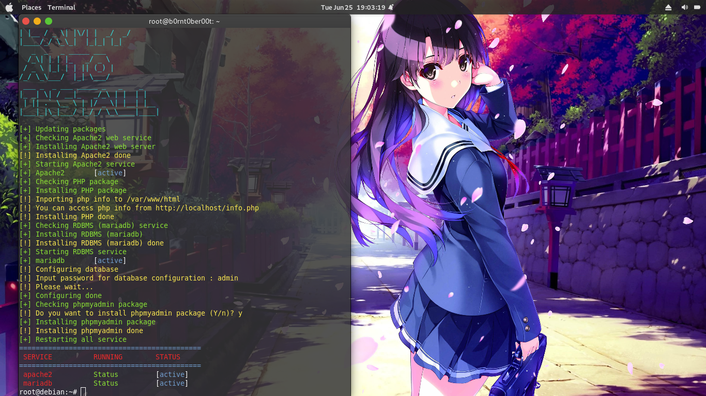
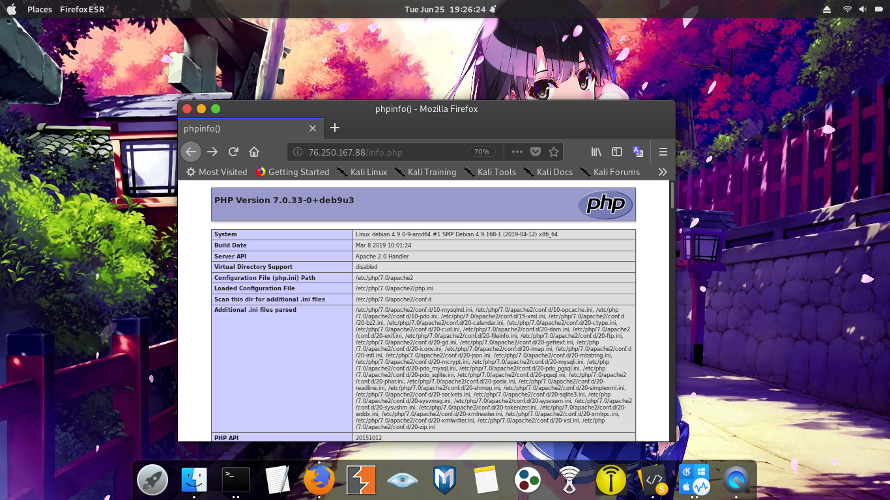
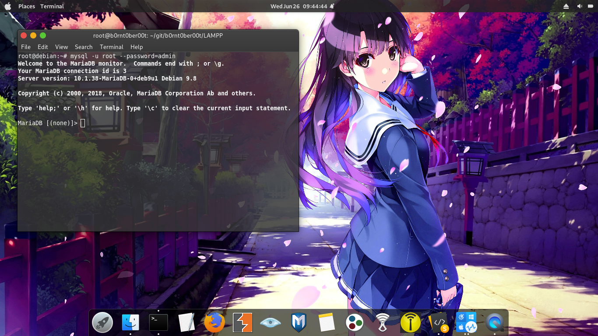

# lampp-auto
Enjoy and have fun

- Install
```
sudo apt update
sudo apt install git
sudo git clone https://github.com/b0rnt0ber00t/lampp-auto.git && cd lampp-auto
sudo chmod +x install.sh
sudo ./install.sh
```
- Screenshot
  - 
  - 
  - 
  - 
  - 
- note!
  - media tester = Debian9.9 (VirtualBox)

- you can change what package you want to install
  > if you want to change the web server service change to line 51
  
  > if you want to change the php package change it to line 52
  
  > if you want to change the database service change it to line 53
